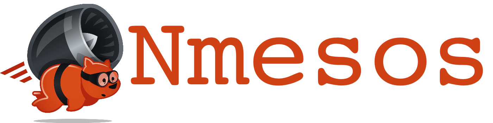
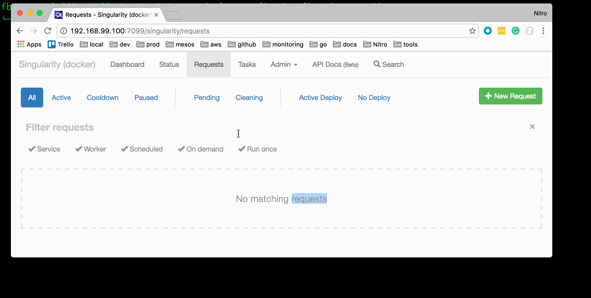

# Nmesos 

Nmesos is a command line tool that leverages [Singularity](https://github.com/HubSpot/Singularity) to deploy new services to [Apache Mesos](http://mesos.apache.org/).




## Features

 - Service configuration in Yaml format.
 - Dryrun mode
 - Auto update (scale up instances and resources if needed)
 - [CLI tool](cli/)
 - [Integration with SBT](sbt-plugin/)(optional)
 
# Usage

### Release a service

The following command will read [example-project.yml](sbt-plugin/example-project/example-project.yml)
and try to release the latest tag in the dev environment.

To release a service difined in `./example-service.yml`:

```
nmesos release example-service --environment dev --tag latest
```

# Getting Started with the CLI tool

Install Nmesos cli:

```
brew tap nitro/nmesos  git@github.com:Nitro/nmesos.git
brew install nmesos-cli
```

Update Nmesos cli:
```
brew update
brew upgrade nmesos-cli
```

Uninstall Nmesos cli:
```
brew uninstall nmesos-cli
```

Alternatively, you can also download and run it with:

```

curl https://s3-us-west-2.amazonaws.com/nitro-public/repo/nitro/nmesos-cli/0.0.8/nmesos-cli-0.0.8.tgz | tar -xz
cd nmesos-cli-0.0.8 && chmod u+x nmesos
````


## Other Comands
```
nmesos release [options] service-name
 Release the a new version of the service.
 Usage:  nmesos release example-service --environment dev --tag 0.0.1
  service-name             Name of the service to release
  -e, --environment <value>
                           The environment to use
  -t, --tag <value>        Tag/Version to release
  -f, --force              Force action
  -n, --dryrun <value>     Is this a dry run?


nmesos scale [options] service-name
 Update the Environment.
 Usage: nmesos scale service_name --environment dev
  service-name             Name of the service to scale
  -e, --environment <value>
                           The environment to use
  -n, --dry-run <value>    Is this a dry run?
```
