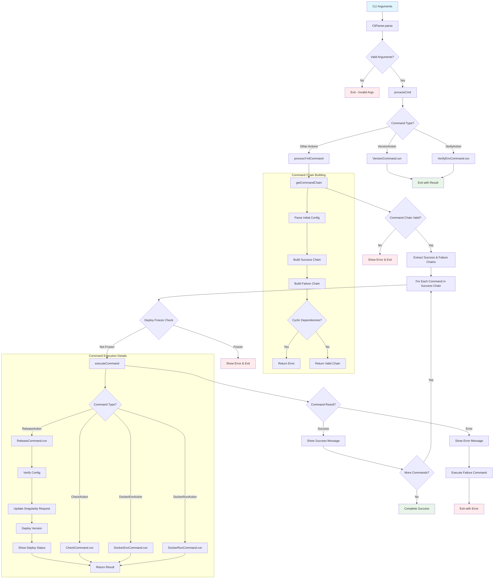

# Command Processing Flow

This flowchart shows the overall command processing flow in nmesos, from CLI argument parsing through command execution and error handling.

## Key Decision Points

1. **Argument Validation**: Early exit if CLI arguments are invalid
2. **Command Type Routing**: Different paths for version/verify vs deployment commands
3. **Command Chain Validation**: Complex validation for dependent deployments
4. **Deploy Freeze Check**: Safety mechanism to prevent deployments
5. **Error Handling**: Comprehensive error handling with failure command execution
6. **Success Chain Processing**: Sequential execution of dependent services

## Error Handling Strategy

- **Early Validation**: Arguments and configuration validated before execution
- **Graceful Degradation**: Failed commands trigger failure recovery mechanisms
- **Context Preservation**: Errors include detailed context and file information
- **Clean Exit**: All error paths lead to proper application termination