# Component Architecture Diagram

This diagram shows the high-level component structure and dependencies within nmesos.

```mermaid
graph TB
    subgraph "CLI Layer"
        A[Main.scala]
        B[CliManager]
        C[CliParser]
        D[model.scala - CLI Types]
    end
    
    subgraph "Command Layer"
        E[BaseCommand]
        F[ReleaseCommand]
        G[CheckCommand]
        H[DockerEnvCommand]
        I[DockerRunCommand]
        J[VerifyEnvCommand]
        K[VersionCommand]
    end
    
    subgraph "Configuration Layer"
        L[ConfigReader]
        M[YamlParser]
        N[Validations]
        O[model.scala - Config Types]
        P[YamlParserHelper]
    end
    
    subgraph "Singularity Integration"
        Q[SingularityManager]
        R[ModelConversions]
        S[model.scala - Singularity Types]
        T[DryrunSingularityManager]
        U[RealSingularityManager]
    end
    
    subgraph "Docker Integration"
        V[SshDockerClient]
        W[model.scala - Docker Types]
    end
    
    subgraph "Sidecar Management"
        X[SidecarManager]
        Y[SidecarUtils]
    end
    
    subgraph "Utility Layer"
        Z[HttpClientHelper]
        AA[Formatter]
        BB[CustomPicklers]
        CC[utils.scala]
        DD[VersionUtil]
    end
    
    subgraph "External Systems"
        EE[Singularity API]
        FF[Docker Daemon]
        GG[YAML Config Files]
    end
    
    %% CLI Layer Dependencies
    A --> B
    B --> C
    B --> D
    C --> D
    
    %% CLI to Command Layer
    B --> E
    B --> F
    B --> G
    B --> H
    B --> I
    B --> J
    B --> K
    
    %% Command Layer Dependencies
    F --> E
    G --> E
    H --> E
    I --> E
    J --> E
    E --> Q
    E --> AA
    
    %% CLI to Configuration
    B --> L
    L --> M
    L --> N
    L --> O
    M --> P
    M --> BB
    N --> O
    
    %% Command to Configuration
    E --> O
    F --> O
    G --> O
    
    %% Singularity Integration
    Q --> R
    Q --> S
    Q --> T
    Q --> U
    T --> Z
    U --> Z
    U --> AA
    R --> S
    R --> O
    
    %% Docker Integration
    H --> V
    I --> V
    V --> W
    V --> Z
    
    %% Sidecar Integration
    X --> Y
    X --> Z
    
    %% Utility Dependencies
    Z --> BB
    AA --> CC
    L --> DD
    M --> CC
    
    %% External System Connections
    U --> EE
    V --> FF
    L --> GG
    
    %% Styling
    classDef cliLayer fill:#e3f2fd
    classDef commandLayer fill:#f3e5f5
    classDef configLayer fill:#e8f5e8
    classDef singularityLayer fill:#fff3e0
    classDef dockerLayer fill:#fce4ec
    classDef sidecarLayer fill:#f1f8e9
    classDef utilityLayer fill:#fafafa
    classDef externalLayer fill:#ffebee
    
    class A,B,C,D cliLayer
    class E,F,G,H,I,J,K commandLayer
    class L,M,N,O,P configLayer
    class Q,R,S,T,U singularityLayer
    class V,W dockerLayer
    class X,Y sidecarLayer
    class Z,AA,BB,CC,DD utilityLayer
    class EE,FF,GG externalLayer
```

## Component Responsibilities

### CLI Layer
- **Main.scala**: Application entry point and delegation
- **CliManager**: Core orchestration and command chain processing
- **CliParser**: Argument parsing with scopt library
- **model.scala**: Command-line data types and structures

### Command Layer
- **BaseCommand**: Shared functionality and Singularity connectivity
- **ReleaseCommand**: Primary deployment logic with monitoring
- **CheckCommand**: Configuration validation without deployment
- **DockerEnvCommand**: Local Docker environment setup
- **DockerRunCommand**: Local Docker container execution
- **VerifyEnvCommand**: Environment and connectivity verification
- **VersionCommand**: Version information display

### Configuration Layer
- **ConfigReader**: YAML file parsing and environment resolution
- **YamlParser**: YAML processing with validation
- **Validations**: Configuration rule validation and checking
- **model.scala**: Configuration data structures
- **YamlParserHelper**: YAML parsing utilities

### Singularity Integration
- **SingularityManager**: API client factory and interface
- **ModelConversions**: Data transformation between models
- **model.scala**: Singularity API data structures
- **DryrunSingularityManager**: Safe simulation implementation
- **RealSingularityManager**: Full API integration implementation

### Docker Integration
- **SshDockerClient**: SSH-based Docker daemon communication
- **model.scala**: Docker-specific data structures

### Sidecar Management
- **SidecarManager**: Sidecar container lifecycle management
- **SidecarUtils**: Sidecar utility functions and helpers

### Utility Layer
- **HttpClientHelper**: HTTP communication foundation
- **Formatter**: User interface and output formatting
- **CustomPicklers**: JSON serialization customization
- **utils.scala**: Common utility functions
- **VersionUtil**: Version parsing and compatibility checking

## Key Design Principles

1. **Layered Architecture**: Clear separation between CLI, business logic, and integration
2. **Dependency Inversion**: Higher layers depend on abstractions, not implementations
3. **Single Responsibility**: Each component has a focused, well-defined purpose
4. **Factory Pattern**: SingularityManager creates appropriate implementations
5. **Strategy Pattern**: Different command implementations for different operations