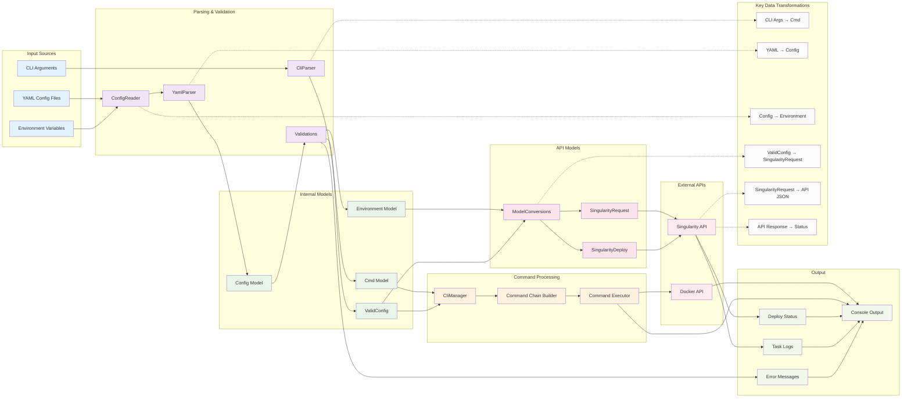
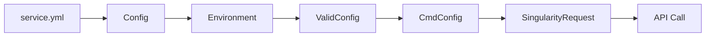
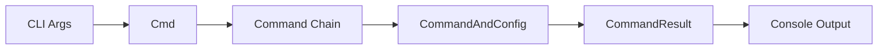
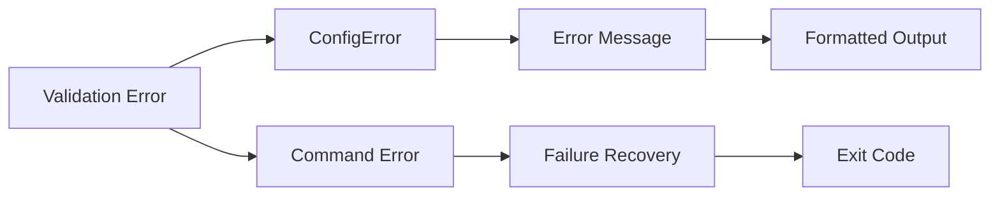

# Data Flow Diagram

This diagram shows how data flows through the nmesos system from configuration files to deployment execution.



## Data Flow Stages

### 1. Input Collection
```
CLI Arguments → Cmd Model
YAML Files → Raw YAML Content
Environment Variables → Configuration Context
```

### 2. Parsing & Validation
```
Raw YAML → Parsed Config Model
Config Model → Environment-Specific Configuration
Environment Config → Validated Configuration
Cmd + ValidConfig → Command Context
```

### 3. Command Chain Processing
```
Initial Command → Command Chain Analysis
Command Chain → Dependency Resolution
Resolved Chain → Sequential Execution Plan
```

### 4. API Model Transformation
```
ValidConfig → SingularityRequest Model
ValidConfig → SingularityDeploy Model
API Models → JSON Payload
JSON Response → Status Objects
```

### 5. External System Integration
```
SingularityRequest → HTTP POST/PUT
SingularityDeploy → HTTP POST
API Responses → Status Updates
Docker Commands → Container Operations
```

### 6. Output Generation
```
Command Results → Formatted Console Output
Deploy Status → Progress Information
Task Information → Deployment Details
Errors → User-Friendly Messages
```

## Key Data Types and Their Flow

### Configuration Data Flow


### Command Data Flow


### Error Data Flow


## Data Validation Points

1. **CLI Argument Validation**: Type checking and required field validation
2. **YAML Structure Validation**: Schema validation and field presence
3. **Environment Validation**: Environment-specific configuration completeness
4. **Business Rule Validation**: Deploy freeze, deprecation checks, resource limits
5. **API Contract Validation**: Request/response model compliance
6. **Runtime Validation**: Connection health, deployment status verification

## Error Handling in Data Flow

- **Early Validation**: Invalid data caught at parsing stage
- **Contextual Errors**: Errors include file paths and line numbers
- **Graceful Degradation**: Partial success scenarios handled appropriately
- **Error Propagation**: Errors bubble up with preserved context
- **User-Friendly Messages**: Technical errors translated to actionable messages