# Deployment Sequence Diagram

This sequence diagram shows the detailed interaction flow during a release command execution, including configuration validation, Singularity API interactions, and deployment monitoring.

```mermaid
sequenceDiagram
    participant User
    participant CLI as CliManager
    participant Parser as CliParser
    participant Config as ConfigReader
    participant Release as ReleaseCommand
    participant Singularity as SingularityManager
    participant API as Singularity API

    User->>CLI: nmesos release service --env prod --tag v1.0.0
    CLI->>Parser: parse(args)
    Parser-->>CLI: Cmd(ReleaseAction, ...)
    
    CLI->>Config: parseEnvironment(file, env)
    Config->>Config: parse YAML file
    Config->>Config: validate configuration
    Config->>Config: check environment variables
    Config-->>CLI: ValidConfig | ConfigError
    
    alt Configuration Error
        CLI-->>User: Show error and exit
    else Configuration Valid
        CLI->>Release: new ReleaseCommand(config)
        CLI->>Release: run()
        
        Release->>Release: verifyCommand()
        Release->>Singularity: ping()
        Singularity->>API: GET /api/requests
        API-->>Singularity: 200 OK
        Singularity-->>Release: Success
        
        Release->>Release: toSingularityRequest(config)
        Release->>Singularity: getRemoteRequest(requestId)
        Singularity->>API: GET /api/requests/request/{id}
        API-->>Singularity: SingularityRequestParent | 404
        Singularity-->>Release: Option[SingularityRequest]
        
        alt No Remote Request
            Release->>Singularity: createSingularityRequest(request)
            Singularity->>API: POST /api/requests
            API-->>Singularity: SingularityRequestParent
            Singularity-->>Release: Success
        else Request Needs Update
            Release->>Singularity: updateSingularityRequest(old, new)
            Singularity->>API: POST /api/requests
            API-->>Singularity: SingularityUpdateResult
            Singularity-->>Release: Success
        else Request Up to Date
            Release->>Release: No update needed
        end
        
        Release->>Release: deployVersionIfNeeded(request)
        Release->>Singularity: getSingularityDeployHistory(requestId, deployId)
        Singularity->>API: GET /api/history/request/{id}/deploy/{deployId}
        API-->>Singularity: SingularityDeployHistory | 404
        Singularity-->>Release: Option[SingularityDeployHistory]
        
        alt Deploy Not Found
            Release->>Release: toSingularityDeploy(config, deployId)
            Release->>Singularity: deploySingularityDeploy(request, deploy, message)
            Singularity->>API: POST /api/deploys
            API-->>Singularity: SingularityRequestParent
            Singularity-->>Release: Success
        else Deploy Exists and Force=true
            Release->>Release: generateRandomDeployId()
            Release->>Singularity: deploySingularityDeploy(request, deploy, message)
            Singularity->>API: POST /api/deploys
            API-->>Singularity: SingularityRequestParent
            Singularity-->>Release: Success
        else Deploy Exists and Force=false
            Release-->>CLI: Failure(Deploy exists, use --force)
        end
        
        alt Dry Run Mode
            Release-->>CLI: CommandSuccess(dry-run message)
        else Real Deployment
            loop Monitor Deployment
                Release->>Singularity: getSingularityPendingDeploy(requestId, deployId)
                Singularity->>API: GET /api/deploys/pending
                API-->>Singularity: Seq[SingularityPendingDeploy]
                Singularity-->>Release: Option[SingularityPendingDeploy]
                Release->>Release: Show progress animation
            end
            
            Release->>Singularity: getSingularityDeployHistory(requestId, deployId)
            Singularity->>API: GET /api/history/request/{id}/deploy/{deployId}
            API-->>Singularity: SingularityDeployHistory
            Singularity-->>Release: Deploy result
            
            Release->>Singularity: getActiveTasks(request)
            Singularity->>API: GET /api/tasks/active
            API-->>Singularity: Seq[SingularityTask]
            Singularity-->>Release: Active tasks
            
            Release->>Release: formatTaskInfo(deployResult, tasks)
            
            alt Deploy Failed
                Release->>Singularity: getLogs(taskId, stdout)
                Release->>Singularity: getLogs(taskId, stderr)
                Singularity->>API: GET /api/sandbox/{taskId}/read
                API-->>Singularity: SingularityLog
                Singularity-->>Release: Log data
                Release->>Release: showLogs()
            end
            
            Release-->>CLI: CommandSuccess | CommandError
        end
        
        CLI-->>User: Final result with deployment status
    end
```

## Key Interaction Patterns

### 1. Configuration Validation Flow
- **File Parsing**: YAML configuration loaded and validated
- **Environment Resolution**: Specific environment extracted from config
- **Validation Chain**: Multiple validation steps with early exit on errors

### 2. Singularity API Integration
- **Health Check**: Connection verification before operations
- **Request Lifecycle**: Create, update, or skip based on remote state
- **Deploy Management**: Version deployment with conflict detection
- **Monitoring**: Real-time deployment progress tracking

### 3. Error Handling Strategy
- **Early Validation**: Configuration errors caught before API calls
- **API Error Handling**: Graceful handling of 404s and other API errors
- **Force Override**: Safe deployment conflict resolution
- **Failure Recovery**: Log collection and error reporting on failures

### 4. Dry Run vs Real Mode
- **Dry Run**: All operations simulated with detailed output
- **Real Mode**: Full API integration with monitoring and logging
- **Consistent Interface**: Same flow regardless of mode

## API Endpoints Used

| Endpoint | Method | Purpose |
|----------|--------|---------|
| `/api/requests` | GET | Health check |
| `/api/requests/request/{id}` | GET | Fetch existing request |
| `/api/requests` | POST | Create/update request |
| `/api/requests/request/{id}/scale` | PUT | Scale request instances |
| `/api/deploys` | POST | Deploy new version |
| `/api/deploys/pending` | GET | Monitor deployment progress |
| `/api/history/request/{id}/deploy/{deployId}` | GET | Get deployment history |
| `/api/tasks/active` | GET | Get active tasks |
| `/api/sandbox/{taskId}/read` | GET | Retrieve task logs |

## State Transitions

1. **Request State**: `NONE` → `ACTIVE` → `DEPLOYED`
2. **Deploy State**: `NONE` → `PENDING` → `SUCCEEDED/FAILED`
3. **Task State**: `PENDING` → `RUNNING` → `FINISHED/FAILED`